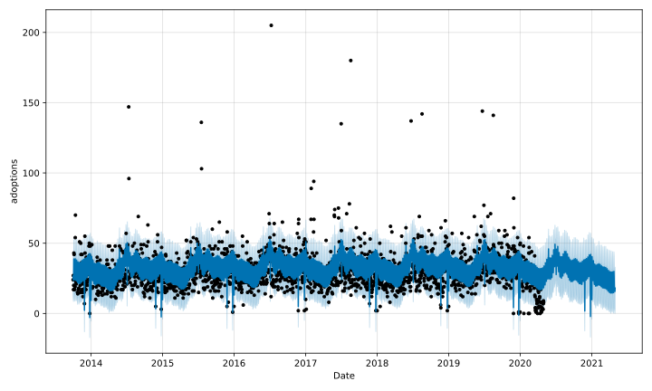
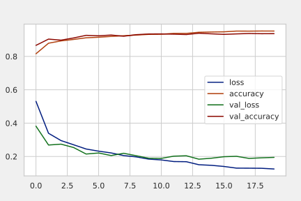

# Caio_portifolio
personal projects

#[Project 1: Exploratory data analysis and forecast with Prophet](https://github.com/caiolgomes/EDA-Texas-animal-shelter-data-base/blob/main/Forecasting_with_Prophet.ipynb)

* In this project I'll be making an exploratory data analysis and forecast of an animal shelter database,I'll be using Prophet for making the forecast. With this analysis, we are expected to be able to identify an adoption pattern.More than identifying a pattern, it is expected to make future predictions in relation to the number of outgoing animals.

#[Project 2:Classifying clothes using deep learning](https://github.com/caiolgomes/Caio_portifolio/blob/main/Clothes_classification_with_CNN.ipynb)

* In this Project i'll be using a well known Dataset for deep learning with 70000 clothes images to make a convolutional neural network and classify them corectly, for this i've used the google tool TensorFlow

